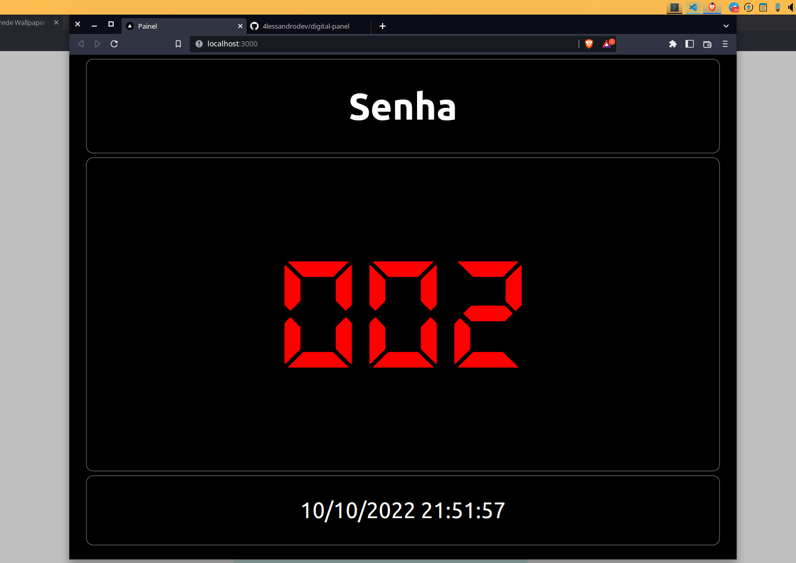

# Painel Digital

Painel Digital para atendimento ao cliente

---

## Senhas sequenciais

### Para iniciar apenas abra a novegador na página:

[https://painel-senha-digital](https://painel-senha-digital.vercel.app/)

### Para ir para a próxima senha pressione uma das teclas:

- Espaço `[space]` ou
- Seta para direita `[>]`

### Para retornar a senha anterior pressione

- Seta para esquerda `[<]`

### Para definir uma senha inicial ou para reiniciar a senha pressione

- Backspace `[<--]`
- Informe uma senha de 3 digitos
- Confirme a senha

### Para colocar em tela cheia pressione a tecla

- F11 `[F11]`

#### Observações

A senha será salva no navegador, sendo assim não tem problema fechar o navegador, quando abrir novamente a senha continuará de onde parou.
