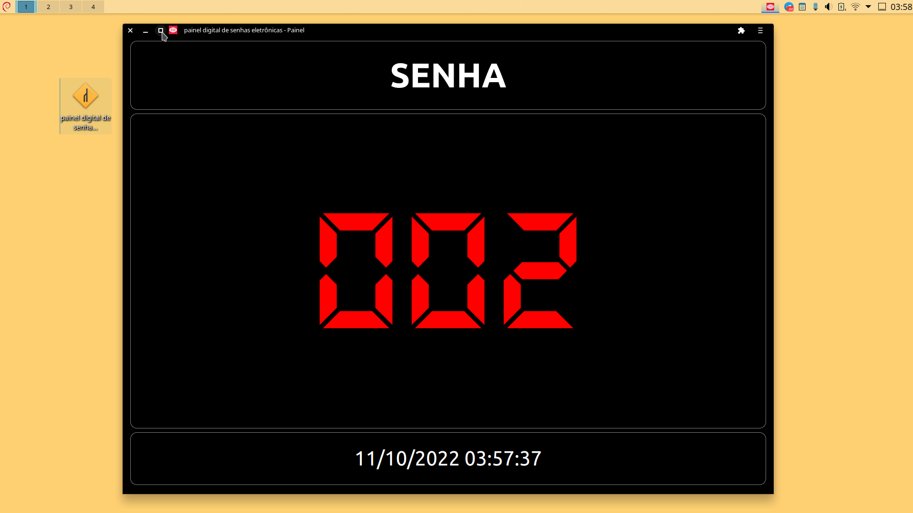

# Painel Digital

Painel Digital para atendimento ao cliente

---

## Senhas sequenciais

### Para iniciar apenas abra a novegador na página:

[https://painel-senha-digital](https://painel-senha-digital.vercel.app/)

### Para ir para a próxima senha pressione uma das teclas:

- Espaço `[space]` ou
- Seta para direita `[>]`

### Para retornar a senha anterior pressione

- Seta para esquerda `[<]`

### Para definir uma senha inicial ou para reiniciar a senha pressione

- Backspace `[<--]`
- Informe uma senha de 3 digitos
- Confirme a senha

### Para colocar em tela cheia pressione a tecla

- F11 `[F11]`

### Para reiniciar do zero pressione

- Delete `[Del]` ou
- Escape `[Esc]`

---

## Offline
### Instalação para suporte offline

Para ter acesso à aplicação sem acesso à internet, instale conforme exemplo abaixo:

- Clique no ícone computador à direita da barra de navegação

- Após instalar um ícone será criado na área de trabalho. Você pode alterar o ícone clicando com o botão direito do mouse se desejar.

- Ao clicar duas vezes no ícone a aplicação será iniciada em tela cheia. Para maximizar você pode clicar na opção maximizar.

#### Observações

Os dados serão salvos na aplicação, sendo assim não tem problema fechá-la, quando abrir novamente a senha continuará de onde parou.

